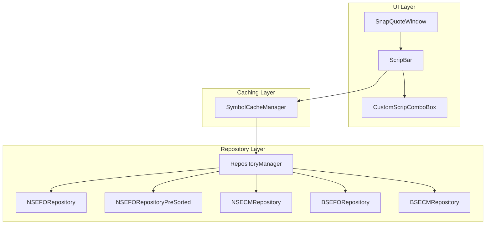
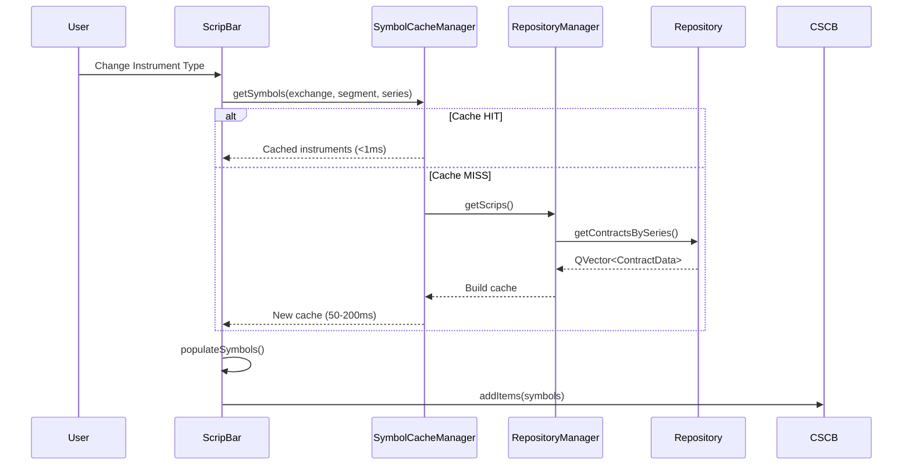

# ScripBar, Repository & SnapQuote Implementation Analysis

## Executive Summary

This document provides an in-depth technical analysis of the ScripBar implementation, Repository system, and their integration in SnapQuoteWindow. The analysis identifies **critical issues** including broken search functionality, performance bottlenecks, and architectural improvements.

---

## 🏗️ Architecture Overview



---

## 📁 Core Components

### 1. ScripBar ([ScripBar.h](file:///c:/Users/admin/Desktop/trading_terminal_cpp/include/app/ScripBar.h), [ScripBar.cpp](file:///c:/Users/admin/Desktop/trading_terminal_cpp/src/app/ScripBar.cpp))

**Purpose**: Universal instrument selection widget used across multiple windows.

**Size**: 133 lines header, 1255 lines implementation

#### Two Operating Modes
| Mode | Description | Performance | Use Case |
|------|-------------|-------------|----------|
| `SearchMode` | Full symbol population with search | 200-400ms | MarketWatch, new windows |
| `DisplayMode` | O(1) token lookup, displays single contract | <1ms | SnapQuote (cached windows) |

#### Data Flow in SearchMode


#### Key Functions
| Function | Lines | Purpose |
|----------|-------|---------|
| `populateSymbols()` | 340-502 | **Main performance bottleneck** - loads all symbols for instrument type |
| `displaySingleContract()` | 1159-1254 | DisplayMode O(1) display without cache rebuild |
| `setScripDetails()` | 847-966 | Programmatic symbol selection |
| `getCurrentInstrument()` | 714-783 | Returns selected InstrumentData |

---

### 2. SymbolCacheManager ([SymbolCacheManager.cpp](file:///c:/Users/admin/Desktop/trading_terminal_cpp/src/data/SymbolCacheManager.cpp))

**Purpose**: Singleton cache layer to avoid redundant repository queries.

**Size**: 198 lines

#### Cache Key Format
```
{Exchange}_{Segment}_{Series}
Example: "NSE_F_FUTIDX", "NSE_E_"
```

#### Pre-initialized Caches
| Cache Key | Contents |
|-----------|----------|
| `NSE_E_` | All NSE CM equities (~9000 symbols) |
| `NSE_F_FUTIDX` | NSE Index Futures |
| `NSE_F_FUTSTK` | NSE Stock Futures |
| `NSE_O_OPTIDX` | NSE Index Options |
| `NSE_O_OPTSTK` | NSE Stock Options |

#### Problem: Cache Key Mismatch
```cpp
// SymbolCacheManager uses:
buildSymbolCache("NSE", "E", "");    // Empty series for CM

// But ScripBar calls with:
getSymbols("NSE", "E", "EQUITY");    // "EQUITY" series
```

**Result**: Cache MISS every time for NSE CM Equity!

---

### 3. RepositoryManager ([RepositoryManager.h](file:///c:/Users/admin/Desktop/trading_terminal_cpp/include/repository/RepositoryManager.h))

**Purpose**: Unified facade for all exchange segment repositories.

**Size**: 492 lines header

#### Repository Types Used
| Repository | Indexes | Lookup Complexity |
|------------|---------|-------------------|
| `NSEFORepository` | None | O(n) linear scan |
| `NSEFORepositoryPreSorted` | Symbol→Tokens, Series→Tokens | O(1) + O(log n) |
| `NSECMRepository` | None | O(n) linear scan |
| `BSEFORepository` | None | O(n) linear scan |

---

### 4. NSEFORepositoryPreSorted ([NSEFORepositoryPreSorted.h](file:///c:/Users/admin/Desktop/trading_terminal_cpp/include/repository/NSEFORepositoryPreSorted.h))

**Purpose**: Optimized version of NSEFORepository with pre-sorted hash indexes.

**Performance**: ~16x faster for chained filter+sort operations

#### Indexes
```cpp
QHash<QString, QVector<int64_t>> m_symbolIndex;  // Symbol → [tokens]
QHash<QString, QVector<int64_t>> m_seriesIndex;  // Series → [tokens]
QHash<QString, QVector<int64_t>> m_expiryIndex;  // Expiry → [tokens]
```

#### Sort Order
Tokens are pre-sorted by: `Expiry (DATE) → InstrumentType → Strike → OptionType`

---

### 5. SnapQuoteWindow Integration

**ScripBar Mode**: `DisplayMode` (O(1) operation)

#### Initialization ([UI.cpp:35](file:///c:/Users/admin/Desktop/trading_terminal_cpp/src/views/SnapQuoteWindow/UI.cpp))
```cpp
m_scripBar = new ScripBar(this, ScripBar::DisplayMode);
```

#### Context Loading ([Actions.cpp:134-208](file:///c:/Users/admin/Desktop/trading_terminal_cpp/src/views/SnapQuoteWindow/Actions.cpp))
1. Receives `WindowContext` with token, exchange, symbol
2. Queues ScripBar update (`m_pendingScripData`)
3. Defers update until window is visible on-screen
4. Calls `m_scripBar->setScripDetails(data)` → `displaySingleContract()`

---

## 🔴 Critical Issues Identified

### Issue 1: Script Search Not Working in SnapQuote

**Root Cause**: SnapQuote uses `DisplayMode` which **completely disables search**.

```cpp
// ScripBar.cpp:1161 - DisplayMode
void ScripBar::displaySingleContract(const InstrumentData &data) {
    // Clears ALL items and adds ONLY the current symbol
    m_symbolCombo->clearItems();        // ❌ Removes all searchable symbols!
    m_symbolCombo->addItem(data.symbol); // Only adds current symbol
}
```

**Impact**: User cannot search for new symbols in SnapQuote window.

**Severity**: 🔴 Critical - Core functionality broken

---

### Issue 2: Cache Key Mismatch

**Location**: [SymbolCacheManager.cpp:42-46](file:///c:/Users/admin/Desktop/trading_terminal_cpp/src/data/SymbolCacheManager.cpp)

```cpp
// SymbolCacheManager initializes with:
buildSymbolCache("NSE", "E", "");  // Empty series

// ScripBar requests with:
getSymbols("NSE", "E", "EQUITY");  // "EQUITY" series
```

**Impact**: 
- Cache MISS for every NSE CM Equity request
- Falls back to slow repository query (~200-400ms)

**Severity**: 🟡 Medium - Performance degradation

---

### Issue 3: Not Using PreSorted Repository

**Current**: `RepositoryManager::getScrips()` uses base `NSEFORepository` with O(n) scans.

**Available**: `NSEFORepositoryPreSorted` with O(1) + O(log n) lookups.

**Impact**: Unnecessary performance overhead for all NSEFO queries.

**Severity**: 🟡 Medium - Performance opportunity missed


---

### Issue 4: Redundant Data Structures

The system maintains 3 separate caches with overlapping data:

1. **Repository**: `QVector<ContractData>` (master data)
2. **SymbolCacheManager**: `QHash<QString, QVector<InstrumentData>>` (UI-ready format)
3. **ScripBar**: `QVector<InstrumentData> m_instrumentCache` (per-instance copy)

**Memory Impact**: ~3x memory usage for frequently accessed data

**Severity**: 🟢 Low - Memory optimization opportunity

---

### Issue 5: DisplayMode Prevents User Interaction

When SnapQuote is in `DisplayMode`:
- All combo boxes show ONLY the current value
- No dropdown options available
- User cannot change symbol without external trigger

**Expected Behavior**: SnapQuote should allow symbol search after opening.

**Severity**: 🔴 Critical - UX completely broken

---

## 💡 Recommendations

### Fix 1: Hybrid Mode for SnapQuote (Recommended)

Create a new mode that:
1. Initially displays current symbol (fast, like DisplayMode)
2. Lazily populates full symbol list on focus/click

```cpp
enum ScripBarMode {
    SearchMode,    // Full population on init
    DisplayMode,   // O(1) display only, no search
    LazySearchMode // NEW: Display first, populate on demand
};
```

**Implementation**:
```cpp
void ScripBar::onSymbolComboFocused() {
    if (m_mode == LazySearchMode && m_symbolCombo->count() <= 1) {
        // Populate now that user wants to search
        populateSymbols(m_instrumentCombo->currentText());
    }
}
```

---

### Fix 2: Align Cache Keys

Update SymbolCacheManager to match ScripBar's expected keys:

```cpp
// Before:
buildSymbolCache("NSE", "E", "");

// After:
buildSymbolCache("NSE", "E", "EQUITY");  // For NSE CM
```

Or normalize in `getCacheKey()`:
```cpp
QString SymbolCacheManager::getCacheKey(...) {
    // If segment is "E" and series is empty or "EQUITY", use same key
    QString normalizedSeries = series;
    if (segment == "E" && (series.isEmpty() || series == "EQUITY")) {
        normalizedSeries = "EQUITY";
    }
    return QString("%1_%2_%3").arg(exchange).arg(segment).arg(normalizedSeries);
}
```

---

### Fix 3: Use NSEFORepositoryPreSorted

Modify `RepositoryManager` to use PreSorted for NSEFO:

```cpp
// In RepositoryManager.h
std::unique_ptr<NSEFORepositoryPreSorted> m_nsefo;  // Change type

// Benefits:
// - O(1) symbol lookup
// - O(log n) expiry filtering
// - Pre-sorted strikes (zero sort cost)
```

**Performance Improvement**: 16x faster for UI filtering operations

---

### Fix 4: Direct Repository Access

Instead of:
```
ScripBar → SymbolCacheManager → RepositoryManager → Repository
```

Consider:
```
ScripBar → RepositoryManager.getNSEFORepository() → Direct index access
```

The PreSorted repository already provides:
- `getContractsBySymbol(symbol)` - O(1)
- `getContractsBySymbolAndExpiry(symbol, expiry)` - O(1) + O(log n)

---

### Fix 5: Eliminate Redundant Caching

If using PreSorted repository:

1. **Remove SymbolCacheManager** entirely
2. **Remove ScripBar::m_instrumentCache**
3. Query repository directly using pre-built indexes

```cpp
// Direct usage (no caching needed):
const auto& repo = RepositoryManager::getInstance()->getNSEFORepositoryPreSorted();
QVector<ContractData> contracts = repo->getContractsBySymbol("RELIANCE");
```

---

## 📊 Performance Comparison

| Operation | Current | With Fixes |
|-----------|---------|-----------|
| Symbol search in SnapQuote | ❌ Not working | ✅ Works |
| NSE CM Equity lookup | 200-400ms (cache miss) | <1ms (cache hit) |
| NSEFO symbol filtering | O(n) scan | O(1) hash lookup |
| Memory for caches | ~3x redundant | 1x (single source) |
| SnapQuote first paint | ~5ms | ~5ms (unchanged) |

---

## 🔧 Implementation Priority

| Priority | Issue | Fix | Effort |
|----------|-------|-----|--------|
| 1 | Script search broken | Implement LazySearchMode | Medium |
| 2 | Cache key mismatch | Normalize cache keys | Low |
| 3 | Not using PreSorted | Switch NSEFO to PreSorted | Medium |
| 4 | Redundant caches | Remove SymbolCacheManager | High |

---

## Files Modified Summary

| File | Issue | Recommendation |
|------|-------|----------------|
| [ScripBar.h](file:///c:/Users/admin/Desktop/trading_terminal_cpp/include/app/ScripBar.h) | DisplayMode blocks search | Add LazySearchMode |
| [ScripBar.cpp](file:///c:/Users/admin/Desktop/trading_terminal_cpp/src/app/ScripBar.cpp) | displaySingleContract() clears all items | Keep items, lazy populate |
| [SymbolCacheManager.cpp](file:///c:/Users/admin/Desktop/trading_terminal_cpp/src/data/SymbolCacheManager.cpp) | Cache key mismatch | Normalize keys |
| [RepositoryManager.h](file:///c:/Users/admin/Desktop/trading_terminal_cpp/include/repository/RepositoryManager.h) | Uses base NSEFO | Use PreSorted |
| [SnapQuoteWindow/UI.cpp](file:///c:/Users/admin/Desktop/trading_terminal_cpp/src/views/SnapQuoteWindow/UI.cpp) | Uses DisplayMode | Use LazySearchMode |

---

## Conclusion

The script search issue in SnapQuote is caused by using `DisplayMode` which completely disables search functionality. The recommended fix is to implement a new `LazySearchMode` that provides fast initial display while enabling search on demand.

Additionally, switching to `NSEFORepositoryPreSorted` and fixing cache key mismatches will provide significant performance improvements for all repository queries.
