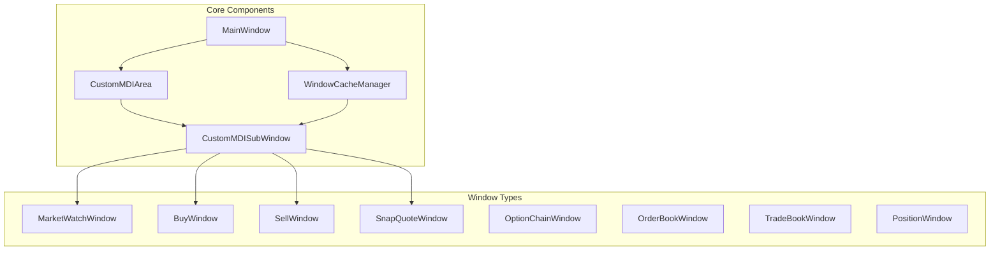
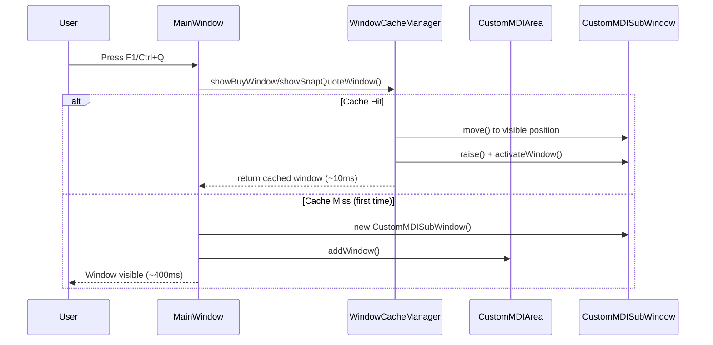
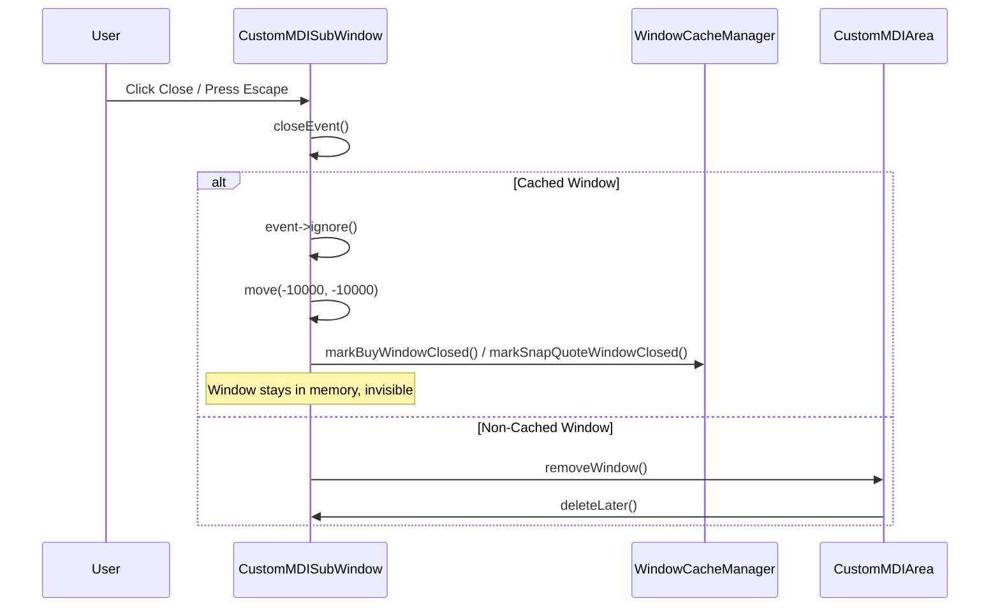
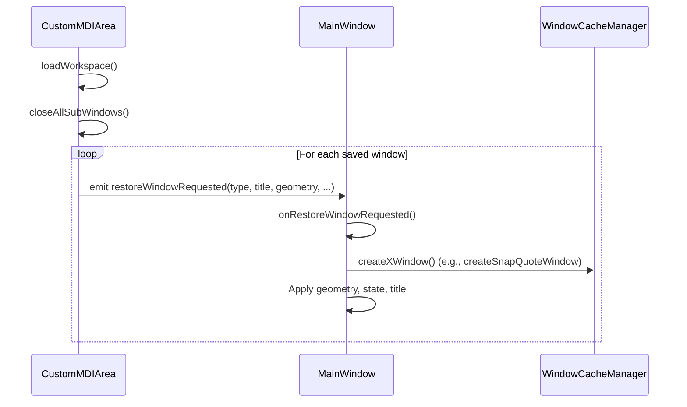

# Window Management System - Technical Documentation

## Recent Optimizations (Feb 2026)

The following issues have been fixed:

| Issue | Status | Fix |
|-------|--------|-----|
| Off-screen windows counted in limit | ✅ Fixed | `Windows.cpp` now only counts visible windows |
| Workspace saves off-screen positions | ✅ Fixed | `CustomMDIArea.cpp` filters off-screen windows |
| Magic numbers throughout codebase | ✅ Fixed | Created `WindowConstants.h` with centralized constants |
| Title corruption during restore | ✅ Fixed | `Windows.cpp` validates title patterns before applying |

**Files Modified:**
- [WindowConstants.h](file:///c:/Users/admin/Desktop/trading_terminal_cpp/include/core/WindowConstants.h) (NEW)
- [Windows.cpp](file:///c:/Users/admin/Desktop/trading_terminal_cpp/src/app/MainWindow/Windows.cpp)
- [CustomMDIArea.cpp](file:///c:/Users/admin/Desktop/trading_terminal_cpp/src/core/widgets/CustomMDIArea.cpp)
- [CustomMDISubWindow.cpp](file:///c:/Users/admin/Desktop/trading_terminal_cpp/src/core/widgets/CustomMDISubWindow.cpp)
- [WindowCacheManager.cpp](file:///c:/Users/admin/Desktop/trading_terminal_cpp/src/core/WindowCacheManager.cpp)

---

## Overview

The trading terminal uses a custom MDI (Multiple Document Interface) implementation built from scratch using Qt widgets. This system avoids Qt's native `QMdiArea`/`QMdiSubWindow` limitations and provides:

- **High-performance window caching** for instant Buy/Sell/SnapQuote window opening
- **Custom window snapping and tiling**
- **Workspace save/restore**
- **LRU-based window reuse** for SnapQuote windows

---

## Architecture



---

## Core Classes

### 1. CustomMDIArea

**File:** `src/core/widgets/CustomMDIArea.cpp` (560 lines)

**Purpose:** Pure C++ MDI container that manages child windows without Qt's `QMdiArea` limitations.

**Key Features:**
- Window list management (`m_windows`, `m_minimizedWindows`)
- Active window tracking (`m_activeWindow`)
- Window arrangement (cascade, tile horizontal/vertical)
- Edge snapping with preview
- Workspace save/load via `QSettings`
- Window cycling (Ctrl+Tab)

**Key Methods:**
| Method | Description |
|--------|-------------|
| `addWindow()` | Adds window to MDI area, positions, shows, and activates |
| `removeWindow()` | Removes window from tracking and calls `deleteLater()` |
| `activateWindow()` | Brings window to front, sets active state |
| `saveWorkspace()` | Serializes all window states to QSettings |
| `loadWorkspace()` | Closes all windows, emits `restoreWindowRequested` signals |

**Signals:**
- `windowActivated(CustomMDISubWindow*)` - When a window gains focus
- `windowAdded/Removed` - Lifecycle events
- `restoreWindowRequested(...)` - Triggers window recreation during workspace load

---

### 2. CustomMDISubWindow

**File:** `src/core/widgets/CustomMDISubWindow.cpp` (720 lines)

**Purpose:** Frameless, draggable, resizable child window widget.

**Key Features:**
- Custom title bar with minimize/maximize/close buttons
- Manual mouse-based dragging and resizing
- Edge resize detection (8px border)
- Pinning support (stays on top)
- **Cached window support** - moves off-screen instead of closing

**Key State:**
| Property | Description |
|----------|-------------|
| `m_windowType` | Type identifier ("MarketWatch", "SnapQuote", etc.) |
| `m_isCached` | If true, `closeEvent` moves window off-screen instead of destroying |
| `m_isMinimized/Maximized` | Window state flags |
| `m_isPinned` | Pinned windows stay on top |

**Critical Optimization - Cached Close:**
```cpp
// In closeEvent() for cached windows:
event->ignore();  // Prevent actual close
move(-10000, -10000);  // Move off-screen (invisible but still rendered)
lower();  // Send to back
```
This avoids expensive `show()` calls on next use.

---

### 3. WindowCacheManager

**File:** `src/core/WindowCacheManager.cpp` (717 lines)

**Purpose:** Singleton that pre-creates windows for instant opening (~10-20ms instead of ~400ms).

**Cached Windows:**
| Window Type | Count | Purpose |
|-------------|-------|---------|
| BuyWindow | 1 | Single order window (enforced limit) |
| SellWindow | 1 | Single order window (enforced limit) |
| SnapQuoteWindow | 3 | Multi-window support with LRU reuse |

**Key Data Structures:**
```cpp
struct SnapQuoteWindowEntry {
    CustomMDISubWindow* mdiWindow;
    SnapQuoteWindow* window;
    int lastToken;           // Last instrument token loaded
    QDateTime lastUsedTime;  // For LRU calculation
    bool needsReset;         // If closed, needs reset before reuse
    bool isVisible;          // Currently visible to user
};

QVector<SnapQuoteWindowEntry> m_snapQuoteWindows;  // Pool of 3 windows
```

**Window Selection Logic (SnapQuote):**
1. **Reuse existing:** If token already displayed in visible window → reuse same window
2. **Use unused:** Find first window where `isVisible == false`
3. **LRU fallback:** All windows in use → evict least recently used

**Key Methods:**
| Method | Description |
|--------|-------------|
| `initialize()` | Called once after MainWindow is ready |
| `createCachedWindows()` | Pre-creates all cached windows off-screen |
| `showBuyWindow/SellWindow()` | Shows cached window with optional context |
| `showSnapQuoteWindow()` | Smart pool selection with LRU logic |
| `markSnapQuoteWindowClosed()` | Called from closeEvent to mark window available |

---

### 4. MainWindow/Windows.cpp

**File:** `src/app/MainWindow/Windows.cpp` (772 lines)

**Purpose:** Window creation factory methods and workspace restoration handler.

**Window Creation Pattern:**
```cpp
CustomMDISubWindow* MainWindow::createSnapQuoteWindow() {
    // 1. Try cache first (fast path)
    CustomMDISubWindow* cached = WindowCacheManager::instance().showSnapQuoteWindow(&context);
    if (cached) return cached;
    
    // 2. Fallback: create new window (slow path - first time only)
    // ... manual window creation ...
}
```

**Key Methods:**
| Method | Description |
|--------|-------------|
| `createMarketWatch()` | Creates MarketWatch window |
| `createBuyWindow/SellWindow()` | Tries cache first, fallback to manual creation |
| `createSnapQuoteWindow()` | Multi-window support with cache + limit enforcement |
| `onRestoreWindowRequested()` | Handles workspace restoration signals |

---

## Data Flow Diagrams

### Window Creation Flow



### Window Close Flow (Cached)



### Workspace Restoration Flow



---

## Identified Issues & Bugs

### 🔴 Critical Issues

#### 1. Title Corruption During Workspace Restore
**Location:** `MainWindow::onRestoreWindowRequested()` (lines 722-744)

**Problem:** Saved workspace titles are blindly applied to windows, even if they don't match the window type. This causes SnapQuote windows to display "Sell Order" titles.

**Root Cause:**
```cpp
// CURRENT CODE (buggy):
if (!title.isEmpty() && window->title() != title) {
    window->setTitle(title);  // Overwrites correct title with corrupted saved title
}
```

**Fix Applied:**
```cpp
// FIXED CODE:
bool shouldSetTitle = false;
if (!title.isEmpty() && window->title() != title) {
    if ((type == "SnapQuote") && title.startsWith("Snap Quote")) {
        shouldSetTitle = true;
    } else if (type == "BuyWindow" && title.contains("Buy")) {
        shouldSetTitle = true;
    }
    // ... validation for other types
}
```

---

#### 2. Off-Screen Windows Counted in Window Limit
**Location:** `MainWindow::createSnapQuoteWindow()` (lines 401-408)

**Problem:** When counting existing SnapQuote windows, off-screen cached windows are included in the count, potentially causing false "Maximum 3 windows" errors.

**Code:**
```cpp
for (auto win : allWindows) {
    if (win->windowType() == "SnapQuote")
        count++;  // Counts ALL windows including off-screen cached ones
}
```

**Recommendation:** Only count visible windows:
```cpp
for (auto win : allWindows) {
    if (win->windowType() == "SnapQuote" && win->geometry().x() >= -1000)
        count++;
}
```

---

#### 3. Cached Windows Not Removed from MDI Window List
**Location:** `CustomMDISubWindow::closeEvent()` (line 217)

**Problem:** When a cached window is "closed" (moved off-screen), it remains in `CustomMDIArea::m_windows`. This causes:
- Inflated window counts
- Windows appearing in cycle list (Ctrl+Tab)
- Workspace save including invisible windows

**Impact:** Workspace files may contain duplicate entries for the same cached window slot.

---

### 🟡 Medium Issues

#### 4. Race Condition in LRU Timestamp Update
**Location:** `WindowCacheManager::showSnapQuoteWindow()` (line 680)

**Problem:** `lastUsedTime` is updated after the window is already visible. If two windows are shown in rapid succession (< 1ms apart), they may have identical timestamps.

**Recommendation:** Use a monotonic counter instead of `QDateTime`:
```cpp
static int s_lruCounter = 0;
entry.lastUsedOrder = ++s_lruCounter;
```

---

#### 5. No Cleanup of Invalid Cached Windows
**Location:** `WindowCacheManager`

**Problem:** If a cached window's content widget is deleted externally (crash, manual deletion), the cache manager still holds invalid pointers.

**Recommendation:** Add null checks and reconnection logic:
```cpp
if (!entry.mdiWindow || !entry.window) {
    // Recreate the window
}
```

---

#### 6. Workspace Save Includes Off-Screen Positions
**Location:** `CustomMDIArea::saveWorkspace()`

**Problem:** Cached windows at position (-10000, -10000) are saved to workspace with their off-screen geometry.

**Impact:** Restoring workspace may position windows off-screen.

**Recommendation:** Skip saving windows with off-screen coordinates:
```cpp
if (window->geometry().x() < -1000) continue;  // Skip off-screen
```

---

### 🟢 Minor Issues

#### 7. Hardcoded Magic Numbers
Multiple files use hardcoded values:
- `-10000` for off-screen position
- `-1000` for "visible" threshold
- `30` for cascade offset

**Recommendation:** Define constants in a shared header:
```cpp
constexpr int OFF_SCREEN_X = -10000;
constexpr int OFF_SCREEN_Y = -10000;
constexpr int VISIBLE_THRESHOLD = -1000;
```

---

#### 8. Missing Thread Safety
`WindowCacheManager` is a singleton accessed from multiple places. While Qt's main thread model usually protects this, there's no explicit documentation or assertions.

**Recommendation:** Add thread safety assertions:
```cpp
Q_ASSERT(QThread::currentThread() == QCoreApplication::instance()->thread());
```

---

#### 9. Memory Leak in Error Paths
**Location:** `MainWindow::createSnapQuoteWindow()` (line 442-500)

**Problem:** If `new CustomMDISubWindow()` succeeds but subsequent setup fails, the window may leak.

**Recommendation:** Use `QScopedPointer` or ensure cleanup in all error paths.

---

## Performance Characteristics

### Window Opening Times

| Scenario | Time | Notes |
|----------|------|-------|
| Cache hit (Buy/Sell) | ~5-10ms | Just move + activate |
| Cache hit (SnapQuote) | ~10-20ms | Same context skip |
| Cache hit (new context) | ~20-30ms | Context load needed |
| First open (no cache) | ~300-500ms | Full window creation |

### Memory Usage

| Component | Approximate Memory |
|-----------|-------------------|
| Per CustomMDISubWindow | ~50KB |
| Per MarketWatchWindow | ~200KB |
| Per SnapQuoteWindow | ~100KB |
| Pre-cached windows (5 total) | ~500KB |

---

## Recommendations for Improvement

### Short-Term
1. ✅ Fix title corruption bug (completed)
2. Filter off-screen windows from workspace save
3. Add visible-only window counting
4. Define constants for magic numbers

### Medium-Term
1. Refactor cached window tracking to use dedicated list instead of relying on MDI area
2. Add window creation factory pattern to centralize all window types
3. Implement proper error handling with RAII

### Long-Term
1. Consider moving to a message-passing architecture for window management
2. Add unit tests for WindowCacheManager
3. Document window lifecycle state machine

---

## File Reference

| File | Lines | Description |
|------|-------|-------------|
| `include/core/widgets/CustomMDIArea.h` | 90 | MDI area header |
| `src/core/widgets/CustomMDIArea.cpp` | 560 | MDI area implementation |
| `include/core/widgets/CustomMDISubWindow.h` | 114 | Subwindow header |
| `src/core/widgets/CustomMDISubWindow.cpp` | 720 | Subwindow implementation |
| `include/core/WindowCacheManager.h` | 152 | Cache manager header |
| `src/core/WindowCacheManager.cpp` | 717 | Cache manager implementation |
| `src/app/MainWindow/Windows.cpp` | 772 | Window factory methods |
