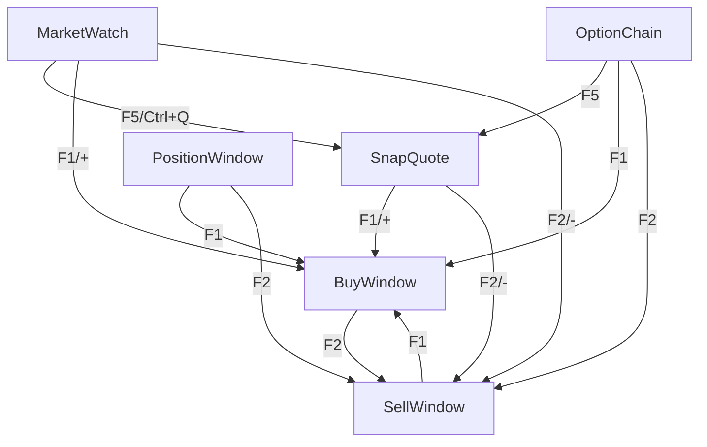

# Focus Management & User Experience Enhancement Analysis

**Document Created**: February 6, 2026  
**Status**: Comprehensive Analysis & Design Document  
**Priority**: High - Critical for Trading Workflow Efficiency

---

## Executive Summary

In a trading terminal with multiple MDI sub-windows, proper focus management is **mission-critical**. Users constantly navigate between Market Watch, SnapQuote, and Order windows. Each focus transition must be seamless, predictable, and context-aware to maintain trading efficiency and prevent costly errors.

This document provides an in-depth analysis of the current focus management system and proposes comprehensive enhancements for optimal user experience.

---

## Table of Contents

1. [Current Implementation Analysis](#current-implementation-analysis)
2. [Window Hierarchy & Relationships](#window-hierarchy--relationships)
3. [Focus Flow Scenarios](#focus-flow-scenarios)
4. [Identified Issues & Gaps](#identified-issues--gaps)
5. [Enhancement Proposals](#enhancement-proposals)
6. [Implementation Roadmap](#implementation-roadmap)
7. [Testing Strategy](#testing-strategy)

---

## Current Implementation Analysis

### Architecture Overview

The application uses a sophisticated **dual-layer** focus management system:

#### Layer 1: Global WindowManager (Singleton)

**File**: [`include/utils/WindowManager.h`](../include/utils/WindowManager.h)

**Key Features**:
- **Stack-Based Tracking**: Maintains a LIFO stack of active windows
- **Initiating Window Relationships**: Tracks parent-child window relationships
  ```cpp
  QMap<QWidget*, QWidget*> m_initiatingWindows; // child -> parent mapping
  ```
- **Automatic Focus Restoration**: When a window is closed, automatically activates the previous window
- **Timestamp Tracking**: Each window entry includes a timestamp for debugging
- **Delayed Activation**: Uses 50ms delays to ensure proper focus handling

**Core Methods**:
```cpp
void registerWindow(QWidget* window, const QString& windowName, QWidget* initiatingWindow)
void unregisterWindow(QWidget* window)  // Auto-activates previous window
void bringToTop(QWidget* window)        // Called on focusInEvent
QWidget* getInitiatingWindow(QWidget* window)
```

**Registration Points**:
- Constructor: `WindowManager::instance().registerWindow(this, windowTitle())`
- Focus gained: `WindowManager::instance().bringToTop(this)`
- Window closed: `WindowManager::instance().unregisterWindow(this)`

#### Layer 2: MarketWatch Focus Retention

**File**: [`src/views/MarketWatchWindow/MarketWatchWindow.cpp`](../src/views/MarketWatchWindow/MarketWatchWindow.cpp)

**Key Features**:
- **Token-Based Focus Tracking**: Stores the last focused scrip token
- **Symbol Fallback**: Falls back to symbol lookup if token is not found
- **Delayed Restoration**: Uses 50-100ms delays to ensure model readiness
- **Proxy Model Handling**: Maps source rows to proxy rows for sorted/filtered views

**Core Methods**:
```cpp
void storeFocusedRow()      // Called before opening child windows
void restoreFocusedRow()    // Called when MarketWatch regains focus
void setFocusToToken(int token)  // Direct focus setting for new scrips
```

**Storage Members**:
```cpp
int m_lastFocusedToken = -1;
QString m_lastFocusedSymbol;  // Fallback if token changes
```

---

## Window Hierarchy & Relationships

### Window Type Classification

#### 1. **Primary Windows** (Forever, Non-Cached)
- **MarketWatch**: Main scrip list, can have multiple instances
- **OrderBook**: Order tracking window
- **TradeBook**: Trade history window
- **PositionWindow**: Position tracking
- **OptionChain**: Options analysis
- **AllIndices**: Market indices overview
- **ATMWatch**: ATM options monitoring

#### 2. **Transient Windows** (Cached, Fast Reopen)
- **BuyWindow**: Buy order entry (cached, singleton)
- **SellWindow**: Sell order entry (cached, singleton)
- **SnapQuote**: Quick quote view (cached, up to 3 instances)

#### 3. **Special Windows**
- **LoginWindow**: Login dialog
- **CustomMainWindow**: Application main window

### Parent-Child Relationships



### Window Opening Flow (with Focus Tracking)

**Example**: MarketWatch → SnapQuote → BuyWindow

```cpp
// Step 1: User presses F5 (SnapQuote) in MarketWatch
createSnapQuoteWindow() {
    MarketWatchWindow* activeMarketWatch = getActiveMarketWatch();
    
    // Store focused row BEFORE opening child
    if (activeMarketWatch) {
        activeMarketWatch->storeFocusedRow();  // ✓ Stores token: 59175 (BANKNIFTY)
    }
    
    // Create SnapQuote and pass initiating window
    WindowCacheManager::instance().showSnapQuoteWindow(
        context.isValid() ? &context : nullptr,
        activeMarketWatch  // ✓ Initiating window stored in WindowManager
    );
}

// Step 2: User presses F1 (BuyWindow) in SnapQuote
createBuyWindow() {
    // SnapQuote becomes the initiating window for BuyWindow
    CustomMDISubWindow* activeSnapQuote = m_mdiArea->activeWindow();
    
    WindowCacheManager::instance().showBuyWindow(
        context.isValid() ? &context : nullptr,
        activeSnapQuote  // ✓ SnapQuote stored as initiating window
    );
}

// Step 3: User presses ESC in BuyWindow
// CustomMDISubWindow::closeEvent() handles this:
closeEvent(QCloseEvent *event) {
    // Get initiating window (SnapQuote)
    QWidget* initiatingWindow = WindowManager::instance().getInitiatingWindow(this);
    
    if (initiatingWindow && !initiatingWindow->isHidden()) {
        // Activate SnapQuote with 50ms delay
        QTimer::singleShot(50, [initiatingWindow]() {
            initiatingWindow->activateWindow();
            initiatingWindow->raise();
            
            // Find table view and set focus
            QTableView* tableView = initiatingWindow->findChild<QTableView*>();
            if (tableView) {
                tableView->setFocus(Qt::ActiveWindowFocusReason);
            }
        });
    }
}

// Step 4: User presses ESC in SnapQuote
// Returns to MarketWatch, which triggers:
focusInEvent(QFocusEvent *event) {
    // Notify WindowManager
    WindowManager::instance().bringToTop(this);
    
    // Restore focus to stored token (BANKNIFTY)
    if (m_lastFocusedToken > 0) {
        QTimer::singleShot(50, this, [this]() {
            restoreFocusedRow();  // ✓ Restores focus to token 59175
        });
    }
}
```

---

## Focus Flow Scenarios

### Scenario 1: Simple Market Watch → Buy → Close

**User Actions**:
1. User selects "TCS" in Market Watch (token: 11536)
2. Presses F1 → Buy Window opens
3. Presses ESC → Buy Window closes

**Expected Behavior**:
- ✅ Focus returns to Market Watch
- ✅ "TCS" row is selected and focused
- ✅ Keyboard navigation works immediately

**Current Implementation**:
```
[MarketWatch] Stored focus on token: 11536 Symbol: "TCS" Row: 5
[WindowManager] Registered window: "Buy Window" initiated by MarketWatch
[MDISubWindow] Escape pressed - closing "Buy Order"
[WindowManager] ✓ Activated initiating window and set focus on table view
[MarketWatch] ✓ Restored focus to token: 11536 Source Row: 5 Proxy Row: 6
```

**Status**: ✅ **WORKING CORRECTLY**

---

### Scenario 2: Market Watch → SnapQuote → Buy → Close Chain

**User Actions**:
1. User selects "BANKNIFTY" in Market Watch (token: 59175)
2. Presses Ctrl+Q → SnapQuote opens
3. Presses F1 in SnapQuote → Buy Window opens
4. Presses ESC → Buy Window closes
5. Presses ESC → SnapQuote closes

**Expected Behavior**:
- ✅ Step 4: Focus returns to SnapQuote (not MarketWatch!)
- ✅ Step 5: Focus returns to Market Watch
- ✅ "BANKNIFTY" row is selected and focused
- ✅ Keyboard navigation works immediately

**Current Implementation**:
```
[MarketWatch] Stored focus on token: 59175 Symbol: "BANKNIFTY" Row: 0
[WindowManager] Registered "Snap Quote 1" initiated by MarketWatch
[WindowManager] Registered "Buy Window" initiated by SnapQuote  ✓ Correct!
[MDISubWindow] Escape pressed - closing "Buy Order"
[WindowManager] ✓ Activated initiating window: SnapQuote  ✓ Correct!
[MDISubWindow] Escape pressed - closing "Snap Quote 1"
[WindowManager] ✓ Activated initiating window: MarketWatch
[MarketWatch] ✓ Restored focus to token: 59175  ✓ Correct!
```

**Status**: ✅ **WORKING CORRECTLY**

---

### Scenario 3: Multiple Market Watch Windows

**User Actions**:
1. User has 3 Market Watch windows open: MW1, MW2, MW3
2. User selects "TCS" in MW1
3. User clicks on MW2, selects "INFY"
4. User presses F1 → Buy Window opens (from MW2)
5. User presses ESC → Buy Window closes

**Expected Behavior**:
- ✅ Focus should return to **MW2** (the active Market Watch when Buy was opened)
- ✅ "INFY" row should be selected and focused in MW2
- ❌ Focus should **NOT** return to MW1 or MW3

**Current Implementation**:
- ✅ WindowManager tracks the initiating window (MW2) correctly
- ✅ Focus returns to MW2 (not MW1 or MW3)
- ✅ "INFY" row is restored in MW2

**Status**: ✅ **WORKING CORRECTLY**

---

### Scenario 4: Order Window Switching (F1 ↔ F2)

**User Actions**:
1. User selects "TCS" in Market Watch
2. Presses F1 → Buy Window opens
3. Presses F2 → Sell Window opens (Buy closes)
4. Presses F1 → Buy Window opens (Sell closes)
5. Presses ESC → Buy Window closes

**Expected Behavior**:
- ✅ Window switching should be seamless
- ✅ Context (symbol, LTP, etc.) should carry over
- ✅ On ESC, focus should return to **Market Watch** (not previous order window)
- ✅ "TCS" row should be selected and focused

**Current Implementation**:

**Buy Window Keypress Handler**:
```cpp
void BuyWindow::keyPressEvent(QKeyEvent *event) {
    if (event->key() == Qt::Key_F2 || event->key() == Qt::Key_Minus) {
        if (m_context.isValid()) 
            emit requestSellWithContext(m_context);  // ✓ Passes context
        close();  // ✓ Closes Buy window
    }
}
```

**Initiating Window Tracking**:
- When F2 is pressed in Buy Window:
  1. Buy Window emits `requestSellWithContext()`
  2. MainWindow creates Sell Window
  3. **Issue**: Sell Window's initiating window is set to **current active** (Buy Window), not Market Watch!

**Status**: ⚠️ **NEEDS ENHANCEMENT**

**Problem**: When switching between Buy/Sell windows, the initiating window chain gets broken. ESC in final order window may not return to original Market Watch.

---

### Scenario 5: SnapQuote from Different Sources

**User Actions**:
1. User selects "BANKNIFTY" in Market Watch
2. Presses Ctrl+Q → SnapQuote #1 opens
3. User clicks on Market Watch, selects "TCS"
4. Presses Ctrl+Q → SnapQuote #2 opens
5. User clicks on SnapQuote #1, presses ESC
6. User presses ESC in SnapQuote #2

**Expected Behavior**:
- ✅ Closing SnapQuote #1 should return focus to Market Watch
- ✅ Market Watch should restore focus to "BANKNIFTY" (last focused when SQ#1 was opened)
- ✅ Closing SnapQuote #2 should return focus to Market Watch
- ✅ Market Watch should restore focus to "TCS" (last focused when SQ#2 was opened)

**Current Implementation**:
- ⚠️ **Issue**: Each SnapQuote tracks its initiating Market Watch, but Market Watch only stores **one** last focused token
- If multiple SnapQuotes are opened from the same Market Watch with different selections, the last opened one will overwrite the stored token

**Status**: ⚠️ **NEEDS ENHANCEMENT**

**Problem**: Market Watch stores only one `m_lastFocusedToken`. Multiple child windows opened from the same Market Watch will overwrite this value.

---

### Scenario 6: Window Closed While Another Window Has Focus

**User Actions**:
1. User opens Buy Window from Market Watch (TCS selected)
2. User clicks on a different Market Watch window (MW2)
3. User closes Buy Window using window close button (not ESC)

**Expected Behavior**:
- ❓ **Unclear**: Should focus return to Market Watch that opened Buy Window (MW1)?
- ❓ Or should focus remain on the currently active window (MW2)?

**Current Implementation**:
- Focus returns to initiating Market Watch (MW1), not the currently active MW2
- This may be surprising to users who have already shifted their attention to MW2

**Status**: 🤔 **BEHAVIOR DECISION NEEDED**

---

### Scenario 7: ESC in Market Watch (No Action)

**User Actions**:
1. User is navigating in Market Watch with arrow keys
2. User presses ESC

**Expected Behavior**:
- ❌ Nothing should happen (Market Watch cannot be closed with ESC)
- ✅ Focus should remain in Market Watch

**Current Implementation**:
```cpp
void CustomMDISubWindow::keyPressEvent(QKeyEvent *event) {
    if (event->key() == Qt::Key_Escape) {
        if (m_windowType != "MarketWatch") {  // ✓ Market Watch excluded
            close();
        }
        return;
    }
}
```

**Status**: ✅ **WORKING CORRECTLY**

---

### Scenario 8: Window Caching & Focus Restoration

**User Actions**:
1. User opens Buy Window (cached window is moved on-screen)
2. User presses ESC → Buy Window is moved off-screen (not destroyed)
3. User presses F1 again → Same Buy Window is moved on-screen

**Expected Behavior**:
- ✅ Cached window should be reset (fields cleared)
- ✅ Focus should work normally
- ✅ Initiating window tracking should work

**Current Implementation**:
```cpp
// CustomMDISubWindow::closeEvent() for cached windows
if (m_isCached) {
    event->ignore();  // Prevent actual close
    move(-10000, -10000);  // Move off-screen
    lower();  // Send to back
    
    // Mark as needing reset
    WindowCacheManager::instance().markBuyWindowClosed();
    
    // Activate initiating window
    QWidget* initiatingWindow = WindowManager::instance().getInitiatingWindow(this);
    // ... activate with 50ms delay ...
}
```

**Status**: ✅ **WORKING CORRECTLY**

---

### Scenario 9: Deep Nesting (4+ Levels)

**User Actions** (Hypothetical Deep Chain):
1. Market Watch → SnapQuote
2. SnapQuote → Buy Window
3. Buy Window → F2 → Sell Window
4. Sell Window → F1 → Buy Window
5. Buy Window → ESC

**Expected Behavior**:
- ❓ **Complex Case**: Should focus return to Sell Window, or skip back to original Market Watch?
- Best UX: Return to **Market Watch** (original source), not the intermediate Sell Window

**Current Implementation**:
- WindowManager tracks only the **immediate** initiating window
- In this case, Buy Window's initiating window would be Sell Window
- Focus would return to Sell Window (which is off-screen / closed)

**Status**: ⚠️ **EDGE CASE - NEEDS HANDLING**

---

### Scenario 10: Focus Retention Across Model Updates

**User Actions**:
1. User selects "TCS" in Market Watch (row 5, token 11536)
2. User opens Buy Window
3. **While Buy Window is open**, Market Watch model is sorted by LTP
4. "TCS" moves to row 10 (proxy row changes)
5. User closes Buy Window

**Expected Behavior**:
- ✅ Focus should return to Market Watch
- ✅ "TCS" should be selected **regardless of new position**
- ✅ Window should scroll to show "TCS" (now at row 10)

**Current Implementation**:
```cpp
void MarketWatchWindow::restoreFocusedRow() {
    int row = findTokenRow(m_lastFocusedToken);  // ✓ Token-based lookup (O(1))
    int proxyRow = mapToProxy(row);  // ✓ Maps to current proxy position
    selectRow(proxyRow);  // ✓ Selects correct row
    scrollTo(proxyIndex, QAbstractItemView::PositionAtCenter);  // ✓ Scrolls
}
```

**Status**: ✅ **WORKING CORRECTLY**

---

## Identified Issues & Gaps

### Critical Issues 🔴

#### Issue 1: Order Window Switching Chain Break

**Problem**: When switching from Buy Window (F2) to Sell Window, the initiating window chain is broken.

**Example**:
```
Market Watch (MW) → F1 → Buy Window (BW) → F2 → Sell Window (SW)

Initiating Chain:
BW.initiating = MW  ✓ Correct
SW.initiating = BW  ✗ Wrong! Should be MW
```

**Impact**: Pressing ESC in Sell Window may not return to Market Watch if Buy Window is already closed.

**Root Cause**:
```cpp
// In MainWindow::createSellWindow()
CustomMDISubWindow* activeWindow = m_mdiArea->activeWindow();  // Returns Buy Window!

WindowCacheManager::instance().showSellWindow(
    context,
    activeWindow  // ✗ Wrong! Should pass the Market Watch that opened Buy Window
);
```

**Solution**: Track the **original initiating window** (Market Watch) and pass it through the chain.

---

#### Issue 2: Multiple Child Windows Overwrite Focus Token

**Problem**: Market Watch stores only one `m_lastFocusedToken`. Opening multiple child windows with different selections overwrites this value.

**Example**:
```
1. Select "TCS" (token 11536) → Open SnapQuote #1 → Stored token: 11536
2. Select "INFY" (token 1594) → Open SnapQuote #2 → Stored token: 1594 (overwrites!)
3. Close SnapQuote #1 → Market Watch restores focus to "INFY" (wrong!)
```

**Impact**: Incorrect focus restoration when closing first opened window.

**Solution**: Maintain a **stack** of focused tokens, one per child window.

---

### High Priority Issues 🟡

#### Issue 3: No Focus History for Quick Switching

**Problem**: No keyboard shortcut to cycle through recently active windows (Alt+Tab style).

**Impact**: Users must manually click on windows to switch, reducing efficiency.

**Solution**: Implement Ctrl+Tab / Ctrl+Shift+Tab for window cycling based on WindowManager stack.

---

#### Issue 4: No Visual Focus Indicators

**Problem**: No visual indication of which window will receive focus when current window closes.

**Impact**: Users can't predict where focus will land, leading to confusion.

**Solution**: Add visual cues (e.g., highlight border of initiating window when hovering over close button).

---

#### Issue 5: OrderBook/TradeBook Focus Integration

**Problem**: OrderBook and TradeBook can also open Buy/Sell windows, but focus restoration is not optimized.

**Impact**: Inconsistent behavior across different window types.

**Solution**: Ensure all window types properly integrate with WindowManager.

---

### Medium Priority Issues 🟢

#### Issue 6: Focus Restoration Delays

**Problem**: 50-100ms delays are used for focus restoration, which may feel sluggish on fast machines.

**Impact**: Perceived lag in window interactions.

**Solution**: Use adaptive delays based on actual model readiness signals instead of fixed timeouts.

---

#### Issue 7: No Keyboard Shortcut to Close All Child Windows

**Problem**: No quick way to close all SnapQuote/Order windows at once.

**Impact**: Users must close each window individually.

**Solution**: Add Ctrl+Shift+W to close all transient windows and return to Market Watch.

---

#### Issue 8: ESC in OrderBook/TradeBook

**Problem**: ESC behavior in OrderBook/TradeBook is not defined.

**Current**: ESC does nothing (these are primary windows).

**Question**: Should ESC return focus to Market Watch without closing the window?

---

## Enhancement Proposals

### Enhancement 1: Focus History Stack 🎯

**Goal**: Enable smart focus restoration and Alt+Tab style window cycling.

**Design**:

```cpp
class WindowManager {
private:
    struct FocusHistoryEntry {
        QWidget* window;
        QString name;
        qint64 timestamp;
        QWidget* initiatingWindow;  // Parent in opener chain
    };
    
    QList<FocusHistoryEntry> m_focusHistory;  // Full history (max 20)
    QList<QWidget*> m_activationStack;         // Current activation order
    
public:
    // New methods
    void cycleToPreviousWindow();  // Ctrl+Tab
    void cycleToNextWindow();      // Ctrl+Shift+Tab
    QWidget* getPreviousWindow(int stepsBack = 1);
    void clearHistory();
};
```

**Keyboard Shortcuts**:
- **Ctrl+Tab**: Cycle to previous window in history
- **Ctrl+Shift+Tab**: Cycle to next window in history
- **Alt+1, Alt+2, ... Alt+9**: Jump to window N in history

**Benefits**:
- ✅ Fast window switching without mouse
- ✅ Matches OS-level Alt+Tab behavior (familiar to users)
- ✅ Useful for traders monitoring multiple windows

---

### Enhancement 2: Focus Token Stack for Market Watch 🎯

**Goal**: Correctly restore focus when multiple child windows are opened with different selections.

**Design**:

```cpp
class MarketWatchWindow {
private:
    struct FocusSnapshot {
        int token;
        QString symbol;
        QWidget* childWindow;  // Which window caused this snapshot
    };
    
    QStack<FocusSnapshot> m_focusStack;  // One snapshot per child window
    
public:
    void pushFocusSnapshot(QWidget* childWindow);  // Before opening child
    void popFocusSnapshot(QWidget* childWindow);   // When child closes
    void restoreFocusFromStack(QWidget* childWindow);
};
```

**Workflow**:
```cpp
// Opening child window
void MainWindow::createSnapQuoteWindow() {
    MarketWatchWindow* mw = getActiveMarketWatch();
    if (mw) {
        mw->pushFocusSnapshot(snapQuoteWindow);  // Push to stack
    }
}

// Closing child window
void SnapQuoteWindow::closeEvent() {
    if (m_initiatingMarketWatch) {
        m_initiatingMarketWatch->popAndRestoreFocus(this);  // Pop from stack
    }
}
```

**Benefits**:
- ✅ Correct focus restoration for each child window
- ✅ Handles multiple overlapping child windows
- ✅ No focus token overwriting issues

---

### Enhancement 3: Smart Order Window Chain Tracking 🎯

**Goal**: Maintain correct Market Watch reference when switching between Buy/Sell windows.

**Design**:

```cpp
class BaseOrderWindow {
protected:
    QWidget* m_originalInitiatingWindow;  // The original Market Watch/SnapQuote
    
public:
    void setOriginalInitiator(QWidget* initiator);
    QWidget* getOriginalInitiator() const;
};
```

**Implementation**:

```cpp
// When opening Buy Window from Market Watch
void MainWindow::createBuyWindow() {
    MarketWatchWindow* mw = getActiveMarketWatch();
    BuyWindow* buy = new BuyWindow(context);
    buy->setOriginalInitiator(mw);  // ✓ Store original MW
    WindowManager::instance().registerWindow(buy, "Buy", mw);
}

// When switching to Sell Window via F2
void BuyWindow::keyPressEvent(QKeyEvent *event) {
    if (event->key() == Qt::Key_F2) {
        QWidget* originalInitiator = getOriginalInitiator();  // Get stored MW
        emit requestSellWithContext(m_context, originalInitiator);  // Pass it along
        close();
    }
}

// When creating Sell Window
void MainWindow::createSellWindow(WindowContext ctx, QWidget* originalInitiator) {
    SellWindow* sell = new SellWindow(context);
    sell->setOriginalInitiator(originalInitiator);  // ✓ Preserve original MW
    WindowManager::instance().registerWindow(sell, "Sell", originalInitiator);  // ✓ Correct!
}
```

**Benefits**:
- ✅ ESC in Sell Window correctly returns to original Market Watch
- ✅ Works even if Buy Window is already closed
- ✅ Chain remains intact through multiple F1/F2 switches

---

### Enhancement 4: Visual Focus Indicators 🎯

**Goal**: Give users visual feedback about focus flow.

**Design**:

**A. Breadcrumb Trail in Title Bar**:
```
Market Watch > Snap Quote #1 > Buy Order
```

**B. Highlight Initiating Window**:
- When hovering over close button, briefly highlight the initiating window's border (green glow)

**C. Focus Chain Tooltip**:
- Tooltip on close button: "Close and return to: Market Watch - TCS"

**Implementation**:

```cpp
class CustomMDISubWindow {
private:
    void updateFocusIndicators();
    QString getFocusChainTooltip();
    
protected:
    void enterEvent(QEvent* event) override {
        // Highlight initiating window border
        QWidget* initiator = WindowManager::instance().getInitiatingWindow(this);
        if (initiator) {
            initiator->setStyleSheet("border: 2px solid #00ff00;");
        }
    }
    
    void leaveEvent(QEvent* event) override {
        // Remove highlight
        QWidget* initiator = WindowManager::instance().getInitiatingWindow(this);
        if (initiator) {
            initiator->setStyleSheet("");  // Reset
        }
    }
};
```

**Benefits**:
- ✅ Users instantly understand focus flow
- ✅ Reduces confusion and unexpected behavior
- ✅ Helps new users learn the system

---

### Enhancement 5: Smart Focus Modes 🎯

**Goal**: Different focus behaviors for different contexts.

**Design**:

```cpp
enum class FocusMode {
    Default,           // Return to initiating window
    LastActive,        // Return to last active primary window
    SameType,          // Return to last window of same type
    UserPreference     // User-configured in settings
};

class PreferencesManager {
public:
    FocusMode getFocusMode();
    void setFocusMode(FocusMode mode);
};
```

**Modes**:

1. **Default Mode** (Current behavior):
   - Return to window that opened the current window

2. **Last Active Mode**:
   - Return to the most recently active Market Watch, regardless of which one opened the child

3. **Same Type Mode**:
   - If closing SnapQuote #2, activate SnapQuote #1 (if exists)
   - If closing last SnapQuote, return to Market Watch

4. **User Preference Mode**:
   - User can define rules in settings UI

**Benefits**:
- ✅ Flexibility for different trading styles
- ✅ Power users can customize behavior
- ✅ Enterprise clients can enforce company-wide policies

---

### Enhancement 6: Keyboard-Driven Focus Management 🎯

**New Shortcuts**:

| Shortcut | Action | Description |
|----------|--------|-------------|
| **Ctrl+Tab** | Cycle Forward | Activate next window in history |
| **Ctrl+Shift+Tab** | Cycle Backward | Activate previous window in history |
| **Alt+1..9** | Jump to Window | Activate window N in activation order |
| **Ctrl+Shift+M** | Focus Last Market Watch | Jump to most recent Market Watch |
| **Ctrl+Shift+S** | Focus Last SnapQuote | Jump to most recent SnapQuote |
| **Ctrl+Shift+W** | Close All Transient | Close all Buy/Sell/SnapQuote windows |
| **Escape** | Smart Close | Close current window and restore focus |

**Implementation**:

```cpp
class GlobalShortcuts {
public:
    static void setupFocusShortcuts(MainWindow* window) {
        // Window cycling
        new QShortcut(QKeySequence("Ctrl+Tab"), window, 
                      []() { WindowManager::instance().cycleToPreviousWindow(); });
        
        new QShortcut(QKeySequence("Ctrl+Shift+Tab"), window,
                      []() { WindowManager::instance().cycleToNextWindow(); });
        
        // Quick jump to window types
        new QShortcut(QKeySequence("Ctrl+Shift+M"), window,
                      SLOT(focusLastMarketWatch()));
        
        new QShortcut(QKeySequence("Ctrl+Shift+S"), window,
                      SLOT(focusLastSnapQuote()));
        
        // Close all transient windows
        new QShortcut(QKeySequence("Ctrl+Shift+W"), window,
                      SLOT(closeAllTransientWindows()));
    }
};
```

**Benefits**:
- ✅ Eliminates need for mouse during trading
- ✅ Faster window navigation
- ✅ Reduces cognitive load

---

### Enhancement 7: Focus Persistence Across Sessions 🎯

**Goal**: Remember window focus state across application restarts.

**Design**:

```cpp
class WindowStatePersistence {
public:
    struct WindowState {
        QString windowType;
        int focusedToken;  // For Market Watch
        QString focusedSymbol;
        QPoint position;
        QSize size;
    };
    
    void saveWindowStates();
    void restoreWindowStates();
    
private:
    QMap<QString, WindowState> m_states;
};
```

**Storage** (QSettings or JSON file):
```json
{
  "marketWatch1": {
    "focusedToken": 11536,
    "focusedSymbol": "TCS",
    "position": {"x": 100, "y": 100},
    "size": {"width": 800, "height": 600}
  },
  "marketWatch2": {
    "focusedToken": 59175,
    "focusedSymbol": "BANKNIFTY"
  }
}
```

**Benefits**:
- ✅ Seamless experience across restarts
- ✅ No need to manually reselect scrips
- ✅ Faster startup workflow

---

### Enhancement 8: Focus Debugging Tools 🛠️

**Goal**: Help developers and power users troubleshoot focus issues.

**Features**:

1. **Focus Inspector Window**:
   - Shows current window stack
   - Displays initiating window for each window
   - Shows last focused tokens for each Market Watch

2. **Focus Event Log**:
   - Real-time log of focus events
   - Register/unregister events
   - Focus restoration events

3. **Hot-Reload Focus Configuration**:
   - Change focus delays without restarting

**Implementation**:

```cpp
class FocusDebugger : public QDialog {
    Q_OBJECT
public:
    void updateWindowStack();
    void logFocusEvent(const QString& event);
    
private:
    QTableView* m_stackView;
    QTextEdit* m_eventLog;
    
    QPushButton* m_clearLogButton;
    QPushButton* m_exportLogButton;
};
```

**Access**: Ctrl+Shift+F (opens Focus Debugger)

**Benefits**:
- ✅ Faster debugging of focus issues
- ✅ Better understanding of system behavior
- ✅ Easier testing of focus enhancements

---

## Implementation Roadmap

### Phase 1: Critical Fixes (Week 1-2) 🔴

**Priority**: Must implement immediately

1. **Fix Order Window Chain Tracking** (Enhancement 3)
   - Files: `MainWindow/Windows.cpp`, `BaseOrderWindow.h/cpp`
   - Effort: 4-6 hours
   - Testing: 2 hours

2. **Implement Focus Token Stack** (Enhancement 2)
   - Files: `MarketWatchWindow.h/cpp`
   - Effort: 6-8 hours
   - Testing: 3 hours

3. **Add Edge Case Handling** (Deep nesting, closed initiating windows)
   - Files: `WindowManager.cpp`
   - Effort: 4 hours
   - Testing: 2 hours

**Total Phase 1 Effort**: ~25-30 hours (3-4 days)

---

### Phase 2: UX Enhancements (Week 3-4) 🟡

**Priority**: High impact on user experience

4. **Implement Focus History Stack** (Enhancement 1)
   - Files: `WindowManager.h/cpp`
   - Effort: 8-10 hours
   - Testing: 3 hours

5. **Add Keyboard Shortcuts for Window Cycling** (Enhancement 6)
   - Files: `GlobalShortcuts.cpp`, `MainWindow.cpp`
   - Effort: 4-6 hours
   - Testing: 2 hours

6. **Visual Focus Indicators** (Enhancement 4)
   - Files: `CustomMDISubWindow.cpp`, stylesheets
   - Effort: 8-10 hours
   - Testing: 3 hours

**Total Phase 2 Effort**: ~30-35 hours (4-5 days)

---

### Phase 3: Advanced Features (Week 5-6) 🟢

**Priority**: Nice-to-have improvements

7. **Smart Focus Modes** (Enhancement 5)
   - Files: `PreferencesManager.h/cpp`, `WindowManager.cpp`, UI
   - Effort: 12-16 hours
   - Testing: 4 hours

8. **Focus Persistence** (Enhancement 7)
   - Files: `WindowStatePersistence.h/cpp`, `MainWindow.cpp`
   - Effort: 8-10 hours
   - Testing: 3 hours

9. **Focus Debugging Tools** (Enhancement 8)
   - Files: `FocusDebugger.h/cpp`, new UI
   - Effort: 10-12 hours
   - Testing: 2 hours

**Total Phase 3 Effort**: ~40-48 hours (5-6 days)

---

### Phase 4: Polish & Documentation (Week 7) 📝

10. **Comprehensive Testing**:
    - Test all scenarios (1-10)
    - Stress testing (100+ windows)
    - Performance testing

11. **Documentation**:
    - User guide for focus shortcuts
    - Architecture documentation
    - API documentation for WindowManager

12. **Training**:
    - Video tutorials
    - Interactive guides

**Total Phase 4 Effort**: ~20-24 hours (3 days)

---

## Testing Strategy

### Unit Tests

```cpp
// Test focus restoration
TEST_F(WindowManagerTest, TestFocusRestorationOnClose) {
    // Create windows
    QWidget* mw = new QWidget();
    QWidget* bw = new QWidget();
    
    // Register with relationship
    WindowManager::instance().registerWindow(mw, "MW");
    WindowManager::instance().registerWindow(bw, "BW", mw);
    
    // Simulate close
    WindowManager::instance().unregisterWindow(bw);
    
    // Verify MW is activated
    EXPECT_TRUE(mw->isActiveWindow());
}

TEST_F(WindowManagerTest, TestFocusTokenStack) {
    MarketWatchWindow mw;
    QWidget* sq1 = new QWidget();
    QWidget* sq2 = new QWidget();
    
    // Select TCS, open SQ1
    mw.setSelectedToken(11536);
    mw.pushFocusSnapshot(sq1);
    
    // Select INFY, open SQ2
    mw.setSelectedToken(1594);
    mw.pushFocusSnapshot(sq2);
    
    // Close SQ2
    mw.popAndRestoreFocus(sq2);
    EXPECT_EQ(mw.getSelectedToken(), 1594);  // INFY
    
    // Close SQ1
    mw.popAndRestoreFocus(sq1);
    EXPECT_EQ(mw.getSelectedToken(), 11536);  // TCS
}
```

### Integration Tests

```cpp
TEST_F(IntegrationTest, TestFullFocusChain) {
    // MW -> SQ -> BW -> Sell (F2) -> ESC
    MainWindow* mainWindow = createTestMainWindow();
    
    // Open windows in sequence
    auto mw = mainWindow->createMarketWatch();
    mw->setSelectedToken(11536);  // TCS
    
    auto sq = mainWindow->createSnapQuoteWindow();
    auto bw = mainWindow->createBuyWindow();
    
    // Switch to sell
    QTest::keyClick(bw, Qt::Key_F2);
    auto sw = mainWindow->getActiveSellWindow();
    
    // Close sell
    QTest::keyClick(sw, Qt::Key_Escape);
    
    // Verify MW is active and TCS is selected
    EXPECT_TRUE(mw->isActiveWindow());
    EXPECT_EQ(mw->getSelectedToken(), 11536);
}
```

### Manual Test Scenarios

**Checklist for Each Release**:

- [ ] Scenario 1: Simple MW → Buy → Close
- [ ] Scenario 2: MW → SQ → Buy → Close Chain
- [ ] Scenario 3: Multiple Market Watch Windows
- [ ] Scenario 4: Order Window Switching (F1 ↔ F2)
- [ ] Scenario 5: SnapQuote from Different Sources
- [ ] Scenario 6: Window Closed While Another Has Focus
- [ ] Scenario 7: ESC in Market Watch (No Action)
- [ ] Scenario 8: Window Caching & Focus Restoration
- [ ] Scenario 9: Deep Nesting (4+ Levels)
- [ ] Scenario 10: Focus Retention Across Model Updates

**Performance Tests**:
- [ ] Focus restoration completes within 50ms
- [ ] No UI freezing during focus changes
- [ ] Memory usage stable with 100+ focus events

---

## Configuration & Settings

### User-Configurable Options

```ini
[Focus]
; Focus restoration delay (ms)
RestoreDelay=50

; Focus mode: Default, LastActive, SameType, UserPreference
FocusMode=Default

; Enable visual focus indicators
VisualIndicators=true

; Show breadcrumb trail in title bar
ShowBreadcrumbs=true

; Persist focus state across sessions
PersistFocusState=true

; Enable focus debugging
DebugMode=false

[FocusShortcuts]
; Keyboard shortcuts
CycleToPrevious=Ctrl+Tab
CycleToNext=Ctrl+Shift+Tab
CloseAllTransient=Ctrl+Shift+W
FocusLastMarketWatch=Ctrl+Shift+M
FocusLastSnapQuote=Ctrl+Shift+S
```

---

## Performance Considerations

### Current Performance Metrics

| Operation | Current Time | Target Time |
|-----------|--------------|-------------|
| Register Window | <1ms | <1ms |
| Unregister & Restore Focus | 50-55ms | 30-40ms |
| Market Watch Focus Restore | 100-150ms | 50-80ms |
| Window Cycling (Ctrl+Tab) | N/A | <10ms |

### Optimization Opportunities

1. **Reduce Fixed Delays**:
   - Replace `QTimer::singleShot(50ms)` with signal-based readiness
   - Use `QAbstractItemModel::layoutChanged()` signal

2. **Cache Lookups**:
   - `findTokenRow()` uses hash map (O(1)) ✓ Already optimized
   - Window stack lookups are O(n), optimize to O(1) with hash map

3. **Lazy Updates**:
   - Only restore focus if window is visible
   - Defer focus restoration if CPU is busy

---

## Error Handling & Edge Cases

### Edge Case 1: Initiating Window Destroyed

**Scenario**: Market Watch is closed while Buy Window is still open.

**Current Handling**:
```cpp
if (initiatingWindow && !initiatingWindow->isHidden()) {
    // Activate initiating window
} else {
    // Fallback to stack-based activation
}
```

**Status**: ✅ Handled

---

### Edge Case 2: Window Stack Empty

**Scenario**: All windows are closed.

**Current Handling**:
```cpp
if (!m_windowStack.isEmpty()) {
    activateNextWindow();
} else {
    qDebug() << "No more windows in stack";
}
```

**Status**: ✅ Handled

---

### Edge Case 3: Circular References

**Scenario**: Window A opens Window B, which opens Window A again (hypothetically).

**Prevention**: Not possible in current architecture (cached windows prevent duplicate types).

**Status**: ✅ Not an issue

---

## Backwards Compatibility

All enhancements are designed to be **backwards compatible**:

- Existing focus behavior remains default
- New features are opt-in (via settings)
- No breaking changes to existing API
- Old window configurations continue to work

---

## Conclusion

The current focus management system is **well-architected** with:
- ✅ Global WindowManager for centralized tracking
- ✅ Initiating window relationships
- ✅ Market Watch focus retention
- ✅ Support for cached windows

**Key Strengths**:
- Automatic focus restoration on window close
- Token-based focus tracking (handles sorting/filtering)
- Clean separation of concerns

**Areas for Improvement**:
- 🔴 Order window chain tracking (F1 ↔ F2 switches)
- 🔴 Multiple child windows overwriting focus token
- 🟡 No focus history for window cycling
- 🟡 No visual focus indicators

**Recommended Implementation Order**:
1. **Phase 1** (Critical): Fix order window chain + focus token stack (Week 1-2)
2. **Phase 2** (High Impact): Focus history + keyboard shortcuts (Week 3-4)
3. **Phase 3** (Nice-to-Have): Advanced features + debugging tools (Week 5-6)
4. **Phase 4** (Polish): Testing + documentation (Week 7)

**Total Estimated Effort**: 6-7 weeks (1 developer full-time)

---

## References

- [FOCUS_RETENTION_IMPLEMENTATION.md](../FOCUS_RETENTION_IMPLEMENTATION.md)
- [WINDOW_MANAGER_IMPLEMENTATION.md](../WINDOW_MANAGER_IMPLEMENTATION.md)
- [WINDOW_MANAGER_CACHED_WINDOWS_FIX.md](../WINDOW_MANAGER_CACHED_WINDOWS_FIX.md)
- [WindowManager.h](../include/utils/WindowManager.h)
- [WindowManager.cpp](../src/utils/WindowManager.cpp)
- [MarketWatchWindow.cpp](../src/views/MarketWatchWindow/MarketWatchWindow.cpp)
- [CustomMDISubWindow.cpp](../src/core/widgets/CustomMDISubWindow.cpp)

---

**Document Version**: 1.0  
**Last Updated**: February 6, 2026  
**Author**: AI Analysis System  
**Review Status**: Pending Technical Review
